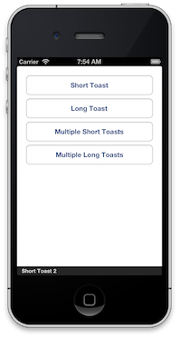
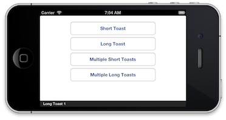

RGToast
=======

RGToast provides a toast through the UI for users to see a temporary message shown on 
the screen. Inspiration for RGToast is taken from both [Matthias Tretter's](https://github.com/myell0w)
[MTStatusBarOverlay](https://github.com/myell0w/MTStatusBarOverlay) and Android's 
[Toast](http://developer.android.com/reference/android/widget/Toast.html) mechanism. 

RGToast currently only shows a toast as an overlay at the bottom of the screen. 

 

My plans are to add different styles of toasts in a future version. 

## Add RGToast to Project

Use [CocoaPods](http://cocoapods.org/) to add RGToast to your `Podfile`:

	pod 'RGToast', '1.0.0'

## Usage

Add RGToast to your ViewController:

	#import "RGToast.h"
	
This call will show a toast with a short duration. 
	
	[[RGToast makeToast:@"Toast!"] show];
	
To get a bit more granular, make this call:

	[[RGToast makeToast:@"Long Toast!" duration:RGToastViewDurationLong] show];

That's it! 

## Sample App

I have also written and provided a sample app called 
[RGToastSample](https://github.com/rwgrier/RGToastSample) that shows you how to use the app. 

## Docs

[Appledocs](./docs)

## Creator

[Ryan Grier](http://github.com/rwgrier)  
[@rwgrier](https://twitter.com/rwgrier)

## License

RGToast is available under the MIT license. See the LICENSE file for more info.